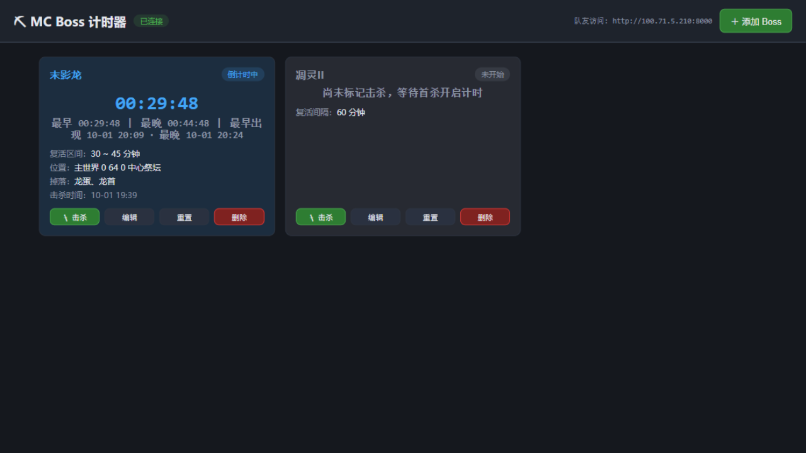

# ⛏ MC Boss 计时器

局域网/虚拟组网多人共享的 Minecraft Boss 复活计时器。一人开主机，队友用浏览器打开就能看：谁打完 Boss 点一下「击杀」，所有人的页面上立刻开始倒计时。配 OCR 自动识别击杀、复活提醒、游戏内悬浮窗、全局热键，单文件 exe 免安装。



## 功能

- **手动配置 Boss**：名称、固定复活间隔或复活时间区间（最早~最晚）、出生位置/坐标、掉落物、备注、OCR 识别关键词（后四项可选）
- **击杀倒计时**：点「击杀」记录时间，实时倒计时 + 复活进度条（区间 Boss 标出复活窗口段）；最后 60 秒红色脉冲提醒
- **补录击杀时间**：打完忘了点，可以手动补录
- **OCR 自动识别击杀**：截屏识别游戏内提示文字，命中关键词自动标记击杀；常驻/手动两种运行模式，双引擎可选（默认关闭）
- **复活到点提醒**：提示音 / Windows 系统通知 / 悬浮窗提醒条，独立开关（默认关闭）
- **全局热键**：游戏内按键直接标记击杀/重置，无需切窗（默认关闭）
- **击杀历史**：每次击杀的时间与来源（手动/热键/OCR）+ 统计
- **配置持久化**：Boss、关键词、窗口位置、全部设置自动保存在本机，重启零重配；支持导出/导入 JSON 换机
- **局域网共享**：任何人的添加/击杀/编辑操作，所有人的页面自动同步；各端用服务器时间校准，电脑时间不准也不影响倒计时一致性
- **自动排序**：快复活的 Boss 排最前，应已复活的单独高亮

## 快速开始（普通用户）

1. 下载 `MCBossTimer.exe`（或按下方「开发与打包」自行构建）
2. 队内一人双击运行，控制台会打印局域网地址，浏览器自动打开计时器
3. 把地址（如 `http://192.168.1.5:8000`）发给队友，浏览器打开即用
4. 首次运行如弹出 Windows 防火墙提示，勾选「专用网络」并允许

> 队友电脑什么都不用装，有浏览器就行。所有人关掉页面不影响计时，主机 exe 不关就一直计时。

## 悬浮窗（游戏内操作）

主机运行 exe 后会同时打开网页和悬浮窗：

- 悬浮窗始终置顶、半透明，按住标题栏可拖到任意位置
- 每个 Boss 一行：名称 + 倒计时 + `杀`（标记击杀）+ `↺`（重置）
- 右上角按钮：`＋` 快速添加（名称+固定间隔）、`—` 折叠成迷你条、`👁` 一键开关 OCR、`⚙` 设置、`✕` 退出
- `⚙` 设置里可配置：OCR 识别（引擎/间隔/触发方式/冷却/框选监测区域）、复活提醒（声音/系统通知/提醒条）、全局热键
- 队友想用悬浮窗：拿到 exe 后用客户端模式启动 `MCBossTimer.exe http://主机IP:8000`，或在悬浮窗 `⚙` 里填主机地址

## OCR 自动识别击杀

打完 Boss 时游戏里如果会出现文字提示（聊天栏公告等），可以让程序自动识别并标记击杀：

1. 编辑 Boss，填写「OCR 识别关键词」（逗号分隔，建议短词，如 `末影龙,击杀`；网页设置里也能集中管理）
2. 悬浮窗点 `👁` 开启识别（或网页设置里开启），⚙ 里可框选监测区域（建议框住左下角聊天栏，比全屏更快更准）
3. **运行模式二选一**：常驻（按间隔自动识别，可勾选「仅游戏前台时识别」省资源）/ 手动（点悬浮窗 `🔍` 或网页「立即试一次识别」才扫一次）
4. 识别命中 → 自动标记击杀，历史里来源标记为「OCR」；也可在设置里改为「仅提醒待确认」模式

- 引擎二选一：**Windows 自带**（系统自带中文模型，占用极低，推荐）/** RapidOCR**（离线推理，更准但 CPU 占用更高）
- 防误触：同一 Boss 触发后有冷却期（默认 60 秒，可调）

## 不在同一局域网？（蒲公英等虚拟组网）

队员和主机不在同一个路由器下时，用虚拟组网工具组成虚拟局域网即可，本工具已适配常见网段：

| 工具 | 虚拟网段 | 支持情况 |
| --- | --- | --- |
| 贝锐蒲公英 | 172.16.x.x | ✅ |
| ZeroTier | 10.x / 192.168.191.x 等 | ✅ |
| Tailscale | 100.x.x.x | ✅ |
| Radmin VPN | 26.x.x.x | ✅ |
| Hamachi | 25.x.x.x | ✅ |

用法：主机运行 exe 后，网页顶栏会列出主机所有网卡的地址（含虚拟网卡）；把对应虚拟网的 `http://虚拟IP:8000` 发给队友，浏览器直接访问。队友用悬浮窗时，点 `⚙` 填入该地址，或用客户端模式 `MCBossTimer.exe http://虚拟IP:8000`。

## 数据与备份

所有数据自动保存在 exe 同目录的 `data/` 下（`bosses.json` Boss 配置、`settings.json` 本机设置、`history.json` 击杀历史），纯文本 JSON，重启不丢失。悬浮窗位置/折叠/透明度也全部记忆。

换机或重装：网页「设置 → 配置管理」导出 JSON，在新机器导入即可，Boss 与关键词一键迁移。

## 开发与打包

```bat
:: 1. 创建虚拟环境并安装依赖（本仓库约定装在 D 盘项目目录内）
python -m venv .venv
.venv\Scripts\pip install -r requirements.txt

:: 2. 开发模式运行
.venv\Scripts\python run.py

:: 3. 打包成单文件 exe（输出 dist\MCBossTimer.exe）
build.bat
```

目录结构：

```
app/
  config.py    全局配置（端口、数据文件路径、版本号）
  storage.py   JSON 持久化（Boss + 击杀历史，带锁、原子写入）
  timer.py     复活时间计算与状态判定
  settings.py  本机功能设置（OCR/提醒/热键，默认全关）
  netclient.py 共享网络客户端（组网地址边界校验）
  watcher.py   OCR 击杀识别线程（双引擎、关键词匹配、冷却）
  notify.py    复活到点提醒线程（声音/系统通知/悬浮窗提醒条）
  hotkeys.py   全局热键线程
  overlay.py   游戏内悬浮窗（tkinter，置顶/拖动/设置/区域框选）
  main.py      FastAPI 路由 + 启动逻辑
static/        前端单页（原生 HTML/CSS/JS，无构建步骤）
run.py         入口：主机模式（服务+网页+悬浮窗）/ 客户端模式（仅悬浮窗）
build.bat      一键打包脚本
```

> 提示：Minecraft 用「无边框全屏」或窗口化时悬浮窗和 OCR 才能正常工作；独占全屏会被游戏盖住且截不到屏。

## API 一览（二次开发用）

| 方法 | 路径 | 说明 |
| --- | --- | --- |
| GET | `/api/state` | 全部 Boss + 服务器时间（含复活状态计算结果） |
| POST | `/api/bosses` | 新增 Boss |
| PUT | `/api/bosses/{id}` | 编辑 Boss |
| DELETE | `/api/bosses/{id}` | 删除 Boss |
| POST | `/api/bosses/{id}/kill` | 标记击杀，body 可传 `{"kill_at": unix秒, "source": "manual|hotkey|ocr"}` |
| POST | `/api/bosses/{id}/reset` | 清除击杀记录，回到未开始 |
| GET | `/api/history` | 击杀历史 + 统计；`DELETE` 清空 |
| GET/PUT | `/api/settings` | 本机功能设置（OCR/提醒/热键/悬浮窗） |
| GET | `/api/export` / POST `/api/import` | 配置导出 / 导入（换机迁移） |
| GET | `/api/watcher` | OCR 识别线程状态与日志；`POST /api/watcher/test` 立即试一次识别 |

## 常见问题

**端口被占用？** 改 `app/config.py` 里的 `PORT` 后重新打包。

**队友打不开页面？** 检查：主机防火墙是否放行（首次运行弹窗点允许；或手动放行 8000 端口）；两台电脑是否在同一局域网；地址里的 IP 是否与主机控制台打印的一致。

## 版本记录

见 [CHANGELOG.md](CHANGELOG.md)。欢迎提 Issue / PR，功能迭代请从 `main` 拉 feature 分支。

## License

[MIT](LICENSE)
